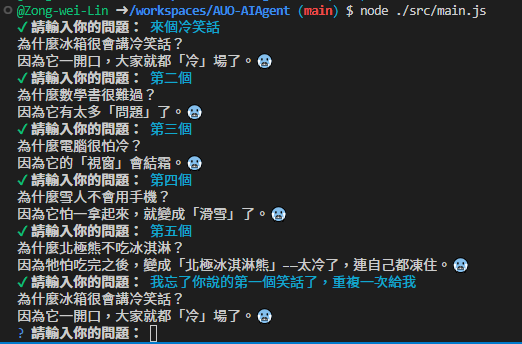
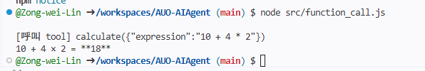
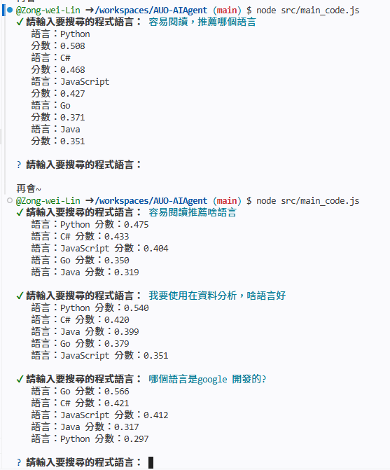
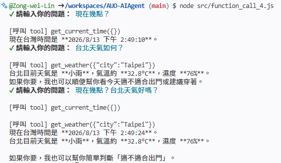

# AUO-AIAgent
AUO-AIAgent_作業


## 作業 1：打造專屬⾓⾊聊天機器⼈

⾓⾊選項:
3. 冷笑話機器⼈ - 專⾨講冷笑話的 AI
```bash
node src/main.js
```



## 作業 2:新增⼀個 Function Calling ⼯具
```bash
node src/function_call.js
```



## 作業 3：建立迷你知識庫
```bash
node src/main_code.js
```



## 作業 4：整合天氣與時間⼯具
```bash
node node src/function_call_4.js
```
