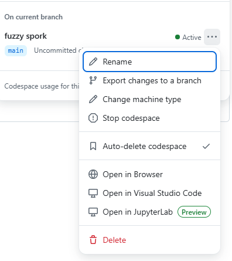
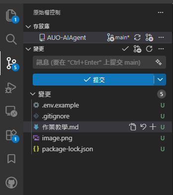

作業教學


## Step 1：建立 GitHub Repo

先到自己的 GitHub 建立一個新的 Repo，接著開啟 CodeSpace。

如果你習慣用本機的 VS Code，也可以用遠端方式開啟 CodeSpace。



選擇 Open in Visual Studio Code。

## Step 2：確認 Node.js 環境

進入 VS Code 之後，點選上方的「終端機」>「新增終端機」，然後在下方終端機輸入：

```bash
node -v
```

如果有顯示版本號，就代表目前有 Node.js 環境。一般來說通常都會有。

## Step 3：建立環境變數檔案

1. 先建立一個新檔案。
2. 按 Ctrl + N 開啟新分頁。
3. 到老師的 GitHub 複製以下內容：

```env
OPENAI_API_KEY=
```

4. 貼到新檔案中。
5. 將檔案儲存為 .env.example。

## Step 4：建立 .env 檔案並填入金鑰

在終端機輸入以下指令：

```bash
cp .env.example .env
```

這個指令的意思是：複製 .env.example，並另外建立一份叫做 .env 的檔案。

接著打開 .env，把你自己的 API Key 貼到 OPENAI_API_KEY= 後面。

你也可以直接新建 .env，然後把完整的 key 寫進去，不一定要先建立 .env.example。


## Step 5 建立一個src資料夾放接下來要作業要的檔案
```bash
mkdir src
```
## Step 6 .gitignore
我忘記這個檔案要不要自己建立了
如果沒有一樣自己新增一下
然後內容是
.env
node_modules/


## Step 7：初始化 Git 並上傳

以上環境就差不多完成了，接下來可以初始化 Git，並把專案上傳到 GitHub。

先到左側欄選擇有分支圖示的原始碼控制面板：



在那個框框，打上第一次Push上去的說明紀錄，並按下送出、確認、同步。
注意!! 這不是正確的Git做法，但偷懶一下。


## 作業 1：準備老師 1.4 版本檔案

參考來源：

1. https://github.com/kaochenlong/ai-agent-js-v2/blob/1.4-openai-api-with-memory/main.js
2. https://github.com/kaochenlong/ai-agent-js-v2/blob/1.4-openai-api-with-memory/db/messages.js
3. https://github.com/kaochenlong/ai-agent-js-v2/blob/1.4-openai-api-with-memory/config.js
4. https://github.com/kaochenlong/ai-agent-js-v2/blob/1.4-openai-api-with-memory/package.json

建立檔案並貼上內容後，請依下列位置存檔：

1. `main.js` 存在 `src/`
2. `config.js` 存在 `src/`
3. `messages.js` 存在 `src/db/`
4. `package.json` 存在專案根目錄

然後
在cmd中跟目錄打，安裝一下套件
```bash
npm i
```

在main.js的await initMessage()裡面打你要加⼊⾓⾊設定（背景、說話⾵格、專業領域）。
在跟目錄cmd中打
```bash
node ./src/main.js
```
就可以開始你的冷笑話ㄌ

截圖然後貼到你的readme.md

去.gitignore更新
新增
.history/
做
Step 7：初始化 Git 並上傳
搞定收工


## 作業2 準備老師2-4檔案

```bash
mkdir utils
mkdir tools
mkdir lib
```

參考來源：

1.https://github.com/Zong-wei-Lin/AUO-AIAgent/blob/main/src/function_call.js

2.https://github.com/kaochenlong/ai-agent-js-v2/blob/2.4-tool-calling-youbike/lib/openai.js

3.https://github.com/kaochenlong/ai-agent-js-v2/blob/2.4-tool-calling-youbike/utils/spinner.js

4.https://github.com/Zong-wei-Lin/AUO-AIAgent/blob/main/src/tools/calculator.js

5.https://github.com/kaochenlong/ai-agent-js-v2/blob/2.4-tool-calling-youbike/package.json


建立檔案並貼上內容後，請依下列位置存檔：

1. `function_call.js` 存在專案根目錄
2. `openai.js` 存在 `src/lib/`
3. `spinner.js` 存在 `src/utils/`
4. `calculator.js` 存在 `src/tools/`
5. 更新一下你的`package.json` 然後 npm i


function_call.js&calculator.js要改喔!

function_call.js主要是問題的存放地。

calculator.js是計算機的計算過程。

然後就可以
```bash
node src/function_call.js
```


## 作業3 準備老師的3-2

首先，先建立一個csv檔，內容自己選一下老師的題目，叫AI給你一版。
然後去老師的

1.https://github.com/kaochenlong/ai-agent-js-v2/blob/3.2-rag-search-text/lib/qdrant.js

2.https://github.com/kaochenlong/ai-agent-js-v2/blob/3.2-rag-search-text/config.js

3.https://github.com/kaochenlong/ai-agent-js-v2/blob/3.2-rag-search-text/package.json

4.https://github.com/Zong-wei-Lin/AUO-AIAgent/blob/main/src/data/codelang.csv

5.https://github.com/kaochenlong/ai-agent-js-v2/blob/3.2-rag-search-text/scripts/embed-netflix.js


1. `qdrant.js` 存在 `src/lib`
2. config.js貼上QDRANT_URL與QDRANT_API_KEY
3. package.json貼上npm i
4. 選一個老師題目的方向，叫AI給你csv，應該是不能上傳，所以要手動在這codespace貼上，並存檔。
5. 建立scripts資料夾，並且存成codelang.js，第8行要改成你4另存的檔名

接下來麻煩了，很多地方要改
main_code.js 要改
qdrant.js 要改 (這邊26行可能會出錯，我有更動可以看我的)
codelang.js 要改
要把csv的欄位改以上這些地方。
舉例:
row.title=>row.(你的csv欄名稱)
show_id: row.show_id =>(你的csv欄名稱):row.(你的csv欄名稱)

```bash
node src/main_code.js
```


## 作業 4 準備老師的2-5

1.https://github.com/kaochenlong/ai-agent-js-v2/blob/2.5-tool-calling-current-time/utils/func-tool.js

2.https://github.com/kaochenlong/ai-agent-js-v2/blob/2.5-tool-calling-current-time/tools/weather.js

3.https://github.com/kaochenlong/ai-agent-js-v2/blob/2.5-tool-calling-current-time/tools/current_time.js

4.https://github.com/kaochenlong/ai-agent-js-v2/blob/2.5-tool-calling-current-time/tools/index.js

5.https://github.com/kaochenlong/ai-agent-js-v2/blob/main/function_call.js

1-2-3直接摳不用改

4把ubike那行刪了 用不到


env 請新增一欄
OPENWEATHER_API_KEY= (你的API，google OPENWEATHER去註冊就拿的到ㄌ)


最困難的是5這步驟，要改依些東西
他會需要再多抓兩個檔案

https://github.com/kaochenlong/ai-agent-js-v2/tree/main/lib
這裡面的`openai.js`、`model.js`都抓回去

然後，請服用應該能用
```bash
node src/function_call_4.js
```
